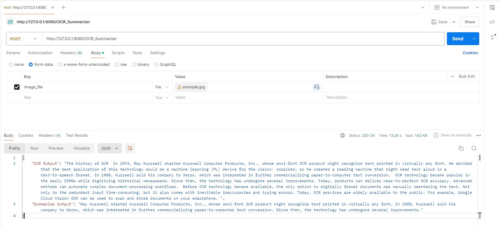

# Optical Character Recognition and Summarize Application 

Hello. This application is a service that extracts and summarises the text written in text photos.


The service can be containerised and run by using postman application. 

You can run below command to start the application.

```bash
docker build . -t ocr_app:v1 
docker run -p 8080:8080 ocr_app:v1 
```

By using Postman, you can get the results like below.

